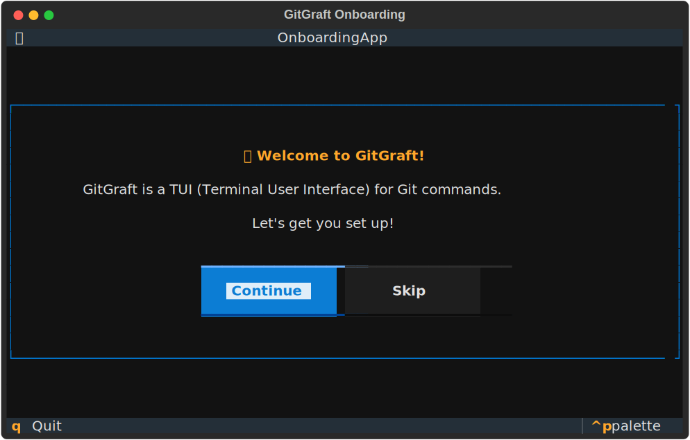
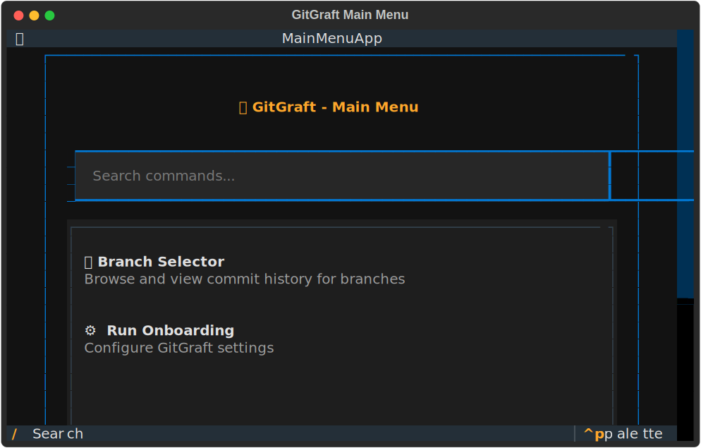
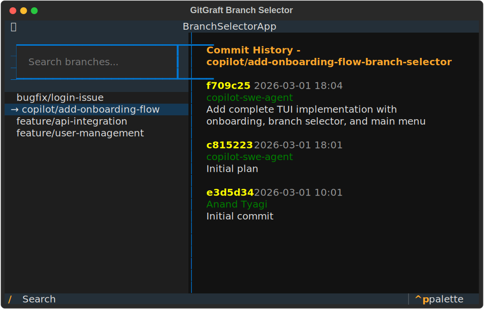

# 🌳 GitGraft

A beautiful Terminal User Interface (TUI) for Git commands.

## Features

- 🎨 **Modern TUI** - Beautiful, intuitive interface built with Textual
- 🔍 **Smart Search** - Filter branches and commands with real-time search
- 📊 **Branch Selector** - Browse branches with commit history visualization
- ⚡ **Quick Access** - Optional `gg` alias for rapid access
- 🎯 **Keyboard Navigation** - Efficient keyboard-driven workflow

## Installation

### From Source

```bash
git clone https://github.com/ananddtyagi/gitgraft.git
cd gitgraft
pip install -e .
```

For a step-by-step guide, see [QUICKSTART.md](QUICKSTART.md).

### Requirements

- Python 3.8+
- Git

## Screenshots

### Onboarding Flow


### Main Menu


### Branch Selector


## Quick Start

After installation, run the onboarding flow:

```bash
graph onboard
```

This will guide you through the initial setup and optionally create a shell alias (`gg`).

## Usage

### Main Menu

Launch the main menu to see all available commands:

```bash
graph
# or if you created the alias:
gg
```

Features:
- Browse available commands
- Search through options with `/`
- Navigate with arrow keys
- Select with Enter

### Branch Selector

View and navigate your Git branches with commit history:

```bash
graph branch
# or with alias:
gg branch
```

Features:
- **Left Panel**: List of all local branches
  - Current branch highlighted with `→`
  - Keyboard navigation with ↑/↓
  - Search branches with `/`
  
- **Right Panel**: Commit history for selected branch
  - Commit hash, author, date, and message
  - Automatically updates when you select a branch
  - Shows last 50 commits

### Keyboard Shortcuts

| Key | Action |
|-----|--------|
| `↑/↓` | Navigate through lists |
| `/` | Focus search input |
| `Enter` | Select item |
| `q` or `Esc` | Quit |

## Configuration

GitGraft stores its configuration in `~/.config/gitgraft/config.json`.

### Shell Alias

The onboarding flow can automatically add an alias to your shell configuration:

```bash
alias gg='graph'
```

This is added to `~/.bashrc` or `~/.zshrc` depending on your shell.

To manually add the alias, add the line above to your shell configuration file and reload:

```bash
source ~/.bashrc  # or ~/.zshrc
```

## Development

### Project Structure

```
gitgraft/
├── gitgraft/
│   ├── __init__.py
│   ├── cli.py              # Main CLI entry point
│   ├── config.py           # Configuration management
│   ├── git_utils.py        # Git repository utilities
│   ├── onboarding.py       # Onboarding flow TUI
│   ├── menu.py             # Main menu TUI
│   └── branch_selector.py  # Branch selector TUI
├── setup.py
├── requirements.txt
└── README.md
```

### Running Tests

```bash
# Test individual modules
python3 -c "from gitgraft.git_utils import GitRepo; print('OK')"

# Test in a git repository
cd /path/to/git/repo
graph branch
```

## Roadmap

- [ ] Interactive branch checkout
- [ ] Merge conflict resolution
- [ ] Stash management
- [ ] Remote branch viewing
- [ ] Pull request integration
- [ ] Commit creation interface
- [ ] Diff viewer

## Contributing

Contributions are welcome! Please feel free to submit a Pull Request.

## License

MIT License - feel free to use this project however you'd like!
